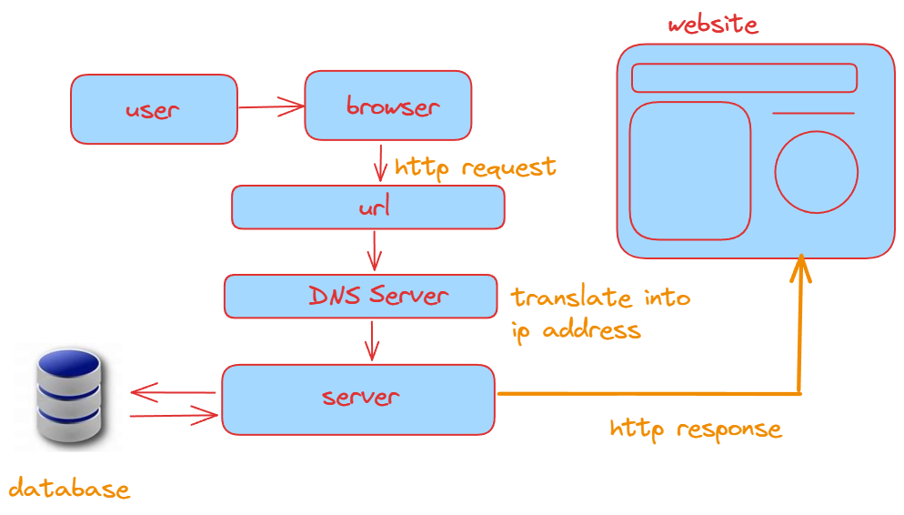

# Introduction: Understanding How the Web Works

In today's world, the internet is like your go-to hub for everything - searching for info, watching videos, or even shopping. But ever wondered how it all comes together? How does your web browser find those websites, like when you type "Google.com"?

It's like a cool mystery, and we're about to uncover the secrets. Let's explore the inner working of web and Internet.

## Defining the Internet

Acoording to the defination of wikipedia, the Internet serves as a global system interconnecting computer networks through the Internet protocol suite (TCP/IP). It facilitates communication between networks of computer and device using Internet Suit Protocol commanly known as (IP/TCP) protocol. By using this protocol Internet exchnages the information between different devices.

## The Essence of the World Wide Web

let's talk about the World Wide Web, or simply the Web.
WWW is changing the world with its power. It's made it super easy to find information, share documents, watch videos, and even grow businesses.

To really get the internet, you've got to understand the Web. 

### Unveiling the Web

Now , let's talk about the World Wide web. Many People things that the web and the Internet both are same but It's not true web is just subset of Internet. It like a big document that hold all the webpages and website together. So, the web is where you can explore these pages and find all kinds of information. 

But before we dive into how the web does its magic, let's pick up some key concepts. Think of them as the tools in your web adventure kit. They'll help you understand what's happening behind the scenes. Ready to gear up?

# Key Concepts

- **Web Pages :** Now, let's dive into web pages. They're like digital documents, filled with all sorts of things - words, links, pictures, buttons, and even forms for you to fill out.they're built using something called HTML which is like the markup language for creating these pages.

- **Websites :** A website is just a bunch of web pages all stuck together with hyperlinks. by clicking hyperlinks we can navigate to the different page. 

- **Web browser :** Think of them as your trusty internet companions. They're like special apps on your computer or phone that make it super easy to visit websites and explore the internet.

So, when you want to check out a website or go on an online adventure, you open your web browser. It's like your friendly middleman between you and the web, helping you find your way around and see all the cool stuff on the internet.

- **IP Address :** IP address is a unique number identifier given to every network and device that connect with internet. IP addressess are used to help the internet find and talk to all these devices. So, the main job of an IP address is to identify where a device is and make sure internet stuff gets to the right place.

- **DNS :** You've got DNS, short for the Domain Name System, and it's like the ultimate translator for the web. Its job is to take those fancy names we give to websites, like "google.com," and turn them into the actual numbers (IP addresses) that the internet understands.

- **HTTP :** It stands for Hypertext Transfer Protocol. It's like the traffic cop of the internet, telling your web browser and servers how to talk to each other. Think of it as a rulebook that explains how to ask for stuff (like web pages) and what to do when you get a response.

- **HTTPS :** Now, while HTTP does most of the heavy lifting in web communication, it's time to talk about the security superhero - HTTPS, or HyperText Transfer Protocol Secure. Think of it as the locked vault for your sensitive stuff, like your login details or credit card information.

- **URL: Uniform Resource Locator:**
  Chances are, you've come across the term URL a bunch of times while surfing the web. Well, URL stands for Uniform Resource Locator. Just think of it as your trusty web address that helps you find your way to all sorts of cool stuff on the internet.

- **Client :**
  In the web world, a client is like your friend that helps you explore and enjoy everything the internet has to offer. It could be a piece of software or a device like your laptop, PC, or phone etc.

- **Server :**
  Think of a server as a  helpful friend on the internet. Servers can be either software or hardware, and their job is to respond when you or your device (the client) ask for something.

So, when you want to see a webpage, a video, or anything on the web, you send a request to the server. The server takes a look at your request, figures out what you need, does some behind-the-scenes magic, and then sends back a response.

Up to this point, we've covered the basic concepts that you need to get a grip on how the web functions. But it's time to dig deeper and find out what goes on behind the scenes, how the web actually gets things done.

# Working of Web

So, there's this guy named Rahul, just an ordinary college student, and one day, he's feeling pretty bored. He decides to treat himself to a Netflix web series. He fires up his web browser and types in "netflix.com" - the web address for Netflix's server.

Now, When Rahul hits the "Enter" button, his browser, acting as the client, has a little question: "Where's this Netflix place?" Browser has no idea about where to find Netflix server so it first request to DNS server to get the IP Address.

The DNS server, like a super smart librarian, looks up the IP address for "netflix.com" in its big book of internet addresses and says, "Aha! Here it is!" Then, it hands that IP address back to Rahul's browser.

With the IP address in hand, Rahul's browser is like, It sends a request to the Netflix server, and that's when the server gets to work. Netflix's server takes a good look at what Rahul wants, processes it using its secret algorithms, fetches data from its digital library if required, and cooks up a special response - an HTTP response.

The server sends this response back to Rahul's browser, 
HTTP response arrived to the Rahul Browser,It reads the response and assembles a beautiful webpage using HTML, CSS, and JavaScript. And just like that, Rahul can see the Netflix website, pick a show, and start watching.

It's like a little web adventure, all thanks to this amazing dance between clients, servers, and the web's magical mechanics!
